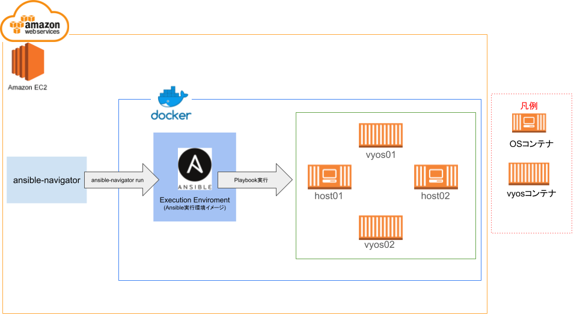

# How to construct env for Ansible with vyos

## install git

```shell
sudo dnf install -y git
```

## git clone

```shell
git clone https://github.com/onoshihou/ansible_with_vyos.git
```

## install docker & poetry by init.sh

```shell
cd ~/ansible_on_vyos

sh ./init.sh
```

## enter venv with "poetry shell"

```shell
cd ~/ansible_on_vyos

poetry shell
```

## docker-compose

```shell
docker-compose -f ./init_settings/docker-compose.yml up -d
```



## exec test playbook

```shell
ansible-navigator run ./ansible_practice/test.yml
```

